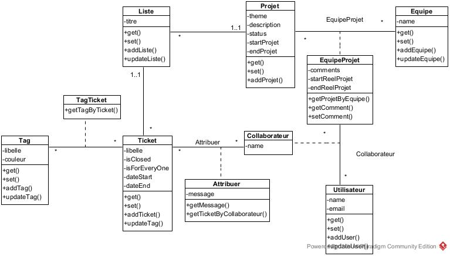

# TP_SIR_THOO_DENAHOU
[](https://forthebadge.com) [](https://forthebadge.com) [](https://forthebadge.com)

## Nom du projet : GestTask API


## Description

GestTask est un projet conçu en s'inspirant de Trello, un outil de gestion de projet. En effet l'objectif est développer une application permettant la gestion d'un projet (ticket, issue en github). Pour y arriver nous avions m'y en place une API permettant de communiquer avec le serveur de base de données.


## Installation 
Avant de démarrer l'installation vérifier que les conditions ci-après sont remplies.

Vous disposer de : 

-  Maven dans votre systhème. Dans le cas contraire, [Site officiel de Maven](https://maven.apache.org/)
-  Git, [Site officiel de Git](https://git-scm.com/)
-  MySQL dans sa **version 8.0.31**
-  JDK

1- Cloner le projet

```
git clone origin https://gitlab.istic.univ-rennes1.fr/othoo/tp_sir_thoo_denahou.git
```
NB: Assurez-vous que vous êtes de le bon répertoire. C'est-à-dire le dossier dans lequel vous souhaiteriez cloner le projet

2- Installation des dépendances

```
mvn install
```


## Présentation des différents dossiers

Les dossiers abordés ici se trouve dans le package jpa se trouvant à la du package java du projet.

- **Repositories** : Il s'agit ici des DAOs. Nous avions mis en place un dao générique afin de gagné du temps. Ce dernier ce trouve dans le dossier **repositories** > **abstracts**.

- **Builders** : Il s'agit du patern builder, utiliser pour chaque mmodèle

- **Dtos** : Data Transfert Object. Il s'agit ici des données accessibles au client

- **Models** : Les entités

- **Resources** : Les controllers, il s'agit des endpoints de l'API

- **Services** : Il s'agit des différents services assurant la communication entre les models et les repositories. Ici se trouve les méthodes permettant d'accéder à la base de donnée au travers des repositories.

- **Validations** : Ce sont les règles de validations mise en place, permettant de controler les informations envoyées par le client.

- **Utils** : Les helpers


## Modélisation de l'application
 



## Démarrage

- Pour lancer le serveur :
  Exécuter le fichier **RestServer** se trouvant à la racine du package _**java**_ du projet.

## Versions
**Dernière version stable :** Sur la branche **jax-rs-branch**

## Test
* Le projet peut être testé, en local, via **Swagger** (Cliquer **[ICI](http://localhost:8080/api/)** après avoir lancé le server en local).

### Postman :
   Veuillez vous référer au swagger pour avoir le format Json des différents endpoints MERCI.


    
## Auteurs
Membres du binôme:
* **Omonliwi Graciela THOO**
* **Michaël Marino DENAHOU**

## License

[](https://lbesson.mit-license.org/)
